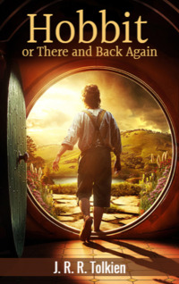

# Hobbit or There and Back Again <kbd>v3.2.1</kbd>

  

## Creator
J. R. R. Tolkien

## Description
Do you like fabulous world in which elves, dwarves, hobbits and dragons live? This book is for you. This story is about adventures of the young hobbit Bilbo Baggins who loves smoking his favourite pipe and eating - these things make his life calm and measured. Once the wizard Gandalf arrives at his house. The visit alarms Bilbo. He does not want such acquaintances. The same evening, some intruders knock on the door. Bilbo does not expect thirteen dwarves and that same wizard to come to him. Moreover, he gets an unusual offer to become a thief and go on a dangerous journey to obtain treasures from the den of the dragon. What choice will Baggins make? You will learn it while reading this book - a popular novel by J. R. R. Tolkien for the whole family.  
