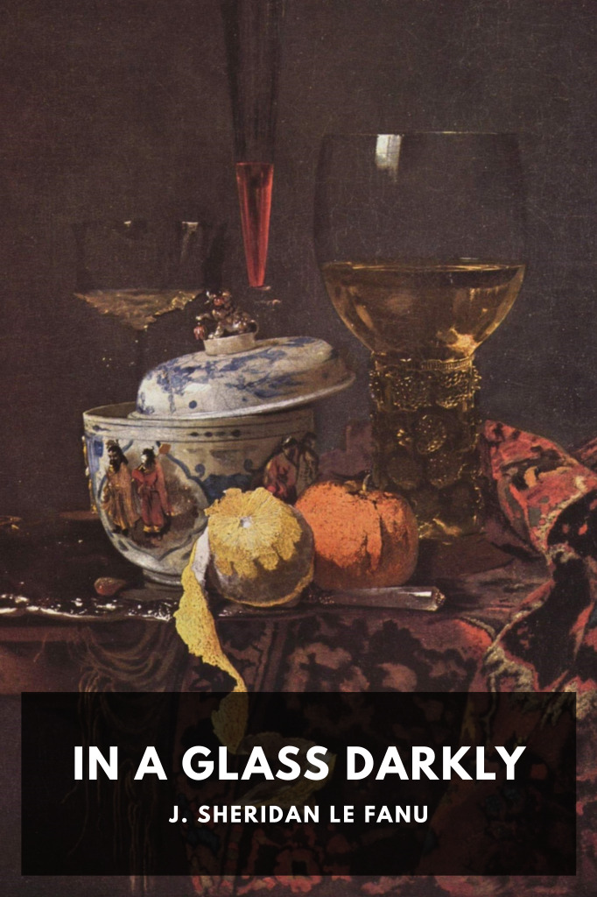

# In a Glass Darkly <kbd>v3.2.1</kbd>

  

## Creator
J. Sheridan Le Fanu

## Description
A collection of five of Le Fanu’s short stories, including his most notable work “Carmilla,” presented as cases of the occult detective Dr. Martin Hesselius.
