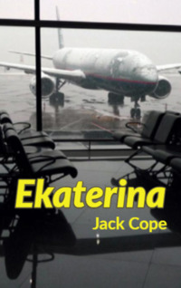

# Ekaterina <kbd>v3.3.1</kbd>

  

## Creator
Jack Cope

## Description
There are countries in which people follow the ancient traditions invented in the Middle Ages. Young boys and girls marry the people that their parents chose for them. Sometimes such marriages are successful and families live happily. But this is not always the case. When people are at a great distance or one family earns much more than another, it becomes difficult to agree. It happens that families live in different countries and getting to each other is long and expensive. But thanks to the invention of aircraft, this problem has ceased to be so complicated. Today you can fly to any part of the world. It takes no more than twenty-four hours. This book begins with a conversation of the characters at the airport. One of the men says that he knows people who even today measure the distance in the days of walking.
