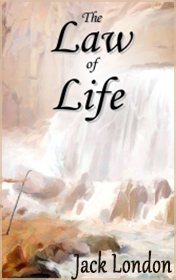

# The Law of Life <kbd>v3.3.1</kbd>

  

## Creator
Jack London

## Description
The old man was sitting quietly in the cold snow. This Indian used to be a chief and everybody listened to his words, but today he was forced to listen to the speeches of others. He was old and blind, but the hearing of this man was the same as in his youth. He heard the cries of his daughter, who was trying to get the dogs to drag the sled. The tribe was preparing for a long trip, because there were no more animals left on these lands to feed everyone. In his youth, the chief was a great hunter. But now his son became the leader of the tribe. The old man was dying. He was very old and had almost no strength left. The other people had their worries and sorrows. The old man had to go his last way alone. The leader came and asked the old man if everything was good with him. He smiled and replied that it was well.
