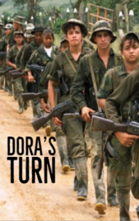

# Dora's Turn <kbd>v3.3.1</kbd>

  

## Creator
Jackee Budesta Batanda

## Description
War is a terrible thing. In any country, city and at any time - it is bad anyway. There were no occasions when it made people happier. A person does not want to kill another person, but he has to do it. In Uganda, Dora and her friend are forced to fight at the war. They have reliable AK-47 assault rifles and heavy pistols. They had time to learn a lot about pain, death and murder. They are only twelve years old, still children. Their commander is called Mad Tiger. He is already fourteen. The cries of a little boy are getting fainter. The Tiger is screaming louder and louder. He orders to go on beating this boy. He shouts that they have to kill bad people, because they are soldiers and this is their job. Other commanders are smoking and smiling not far away.
