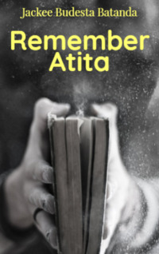

# Remember Atita <kbd>v3.3.1</kbd>

  

## Creator
Jackee Budesta Batanda

## Description
War is the worst thing that can happen to any land and its inhabitants. When war begins, people's lives collapse. People lose each other, parents lose children, sisters part with their brothers, and husbands lose their wives. Atita is the main character of this story. She is trying to find her lost friends. The only memory of them is an old battered photograph that was taken almost twenty years ago. There are few children at the photo. They are smiling, though they are dressed in rags and covered in mud. These children have no money, but they are happy. At night, Atita sleeps in the store, hiding from aggressive soldiers. She still has not found anyone, but keeps searching. In the store where she sleeps, many people gather from nearby villages. It is even cozy here, the radio is playing and there is some food.
