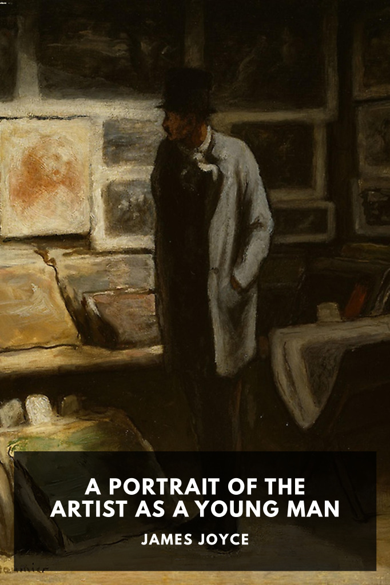

# A Portrait of the Artist as a Young Man <kbd>v3.3.1</kbd>

  

## Creator
James Joyce

## Description
The autobiographical story of Joyce’s youth in Ireland and his escaping the country’s conformity and mediocrity to blossom as a writer on the continent.
