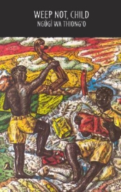

# Weep Not, Child <kbd>v3.2.1</kbd>

  

## Creator
James Ngugi

## Description
This story is set in Kenya when it was a British colony. The colonial settlers took away Kenyan people's land. They forced Africans to work on the stolen land. They made many laws that were against African people. The K.A.U. - the Kenyan African Union - was formed by black Kenyan leaders in 1944. But the British colonial rulers refused to recognize the leaders of the K.A.U. and did not allow them to have positions of responsibility. The K.A.U. wanted to change the colonial government and the laws by peaceful means. They wanted to have the colour bar removed so that the black people would have equal rights with the whites; they wanted the land returned to the black farmers and they wanted black people to govern their own country.
