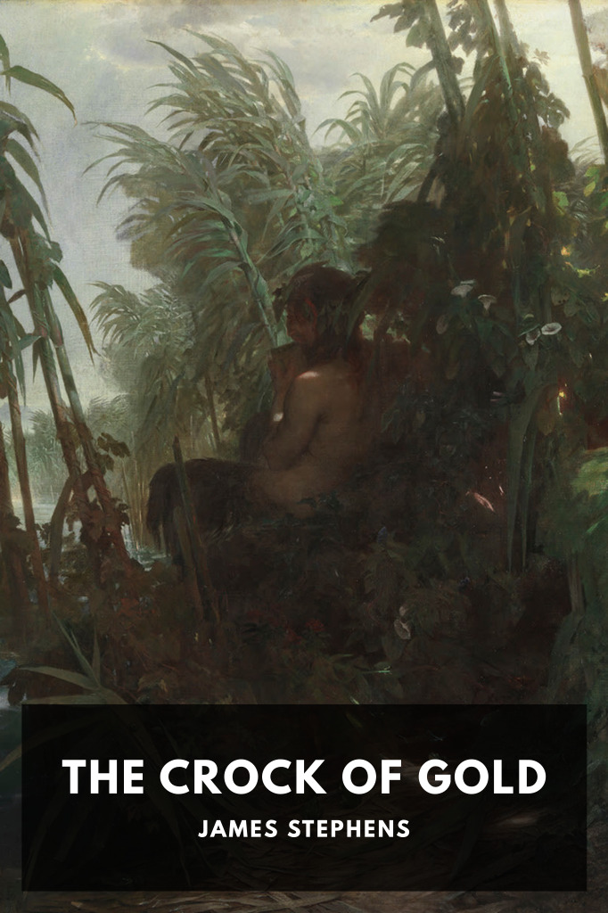

# The Crock of Gold <kbd>v3.3.1</kbd>

  

## Creator
James Stephens

## Description
A philosopher sets out to rescue the beautiful Caitilin Ni Murrachu from the god Pan in an adventure that involves leprechauns, Celtic gods, policemen, and philosophical disquisitions both profound and absurd.
