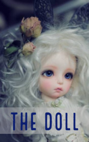

# The Doll <kbd>v3.2.1</kbd>

  

## Creator
Jan Carew

## Description
Mr. Brown's house is not far from the center of the city. But despite this, he has a nice small garden with lots of flowers. Mr. Brown likes sitting there for hours, resting after a long day. He would just sit and look at the bright flowers. His work is far from home, he has to go there by bus. Mr. Brown has almost no friends. He returns from the office and sits in his garden, lonely and sad. One day he decides to go home on foot: the day is hot. He wants to take a walk. On the way, Mr. Brown sees the store - old things are being sold there, and the man decides to stop by. He examines the goods and sees an old doll with a very sad face. Mr. Brown thinks this doll is as lonely as he is. He buys it, even though he is an adult who does not play with dolls.
