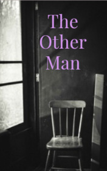

# The Other Man <kbd>v3.3.1</kbd>

  

## Creator
Jan Carew

## Description
The protagonist of this story is a professional writer. He wrote and sold books. He writes them nowadays too, but people don't know about it. Once he decided to write a very big novel: he found a small room and thought that this was a very good place to write a book. He began his work and was very pleased. But later strange things started happening. One day he decided that he wanted a cup of coffee. The man left his pen on the table and went out. But when he returned - the pen was gone, even though he was trying to find it. And at night he woke up and realized that there was someone in the room, but nobody was visible. After this, the oddities continued. They became even more. But the writer wanted to finish the book and he stayed in this small strange room. Once he saw another person's face in a small mirror on the wall.
