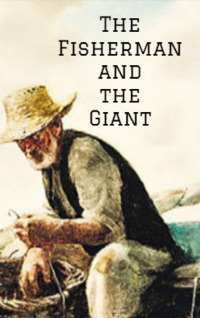

# The Fisherman and the Giant <kbd>v3.3.1</kbd>

  

## Creator
Jane Rollason

## Description
In very old times a poor fisherman lived in one country. He was not successful and could not catch enough fish. His catch was small. It was not enough to buy other food or things. His family ate only fish. One day the poor fisherman caught only a dead horse. He thought it to be the worst day ever. Then he pulled out an old bag and threw it back. Next came an old jug, which turned green from the water. The fisherman washed it and decided to sell this find. The day was becoming more enjoyable. But first the fisherman dared open the jug. Some clouds of thick white smoke came from it. Suddenly a giant appeared. The poor fisherman understood that this was the beginning of an adventure, at the end of which he would receive either a reward or death.
