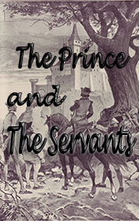

# The Prince and the Servants <kbd>v3.2.1</kbd>

  

## Creator
Jane Rollason

## Description
In olden times one far country was ruled by a lazy and greedy queen. She had a beautiful daughter. Many kings and princes wanted to marry her, but the queen always gave them difficult tasks. When the suitors for the princess were unable to cope with these ordeals - she killed them without mercy. This had been going on for a few years. She wanted her daughter to never get married. Prince Charles lived in a small poor country. When he heard about the princess, he told his father that he wanted to marry her. The king was against it.  In the world there were many other beautiful women. And the evil queen killed every groom. But the young prince got upset. He could not sleep and eat. Finally the King let him go on this dangerous mission.
