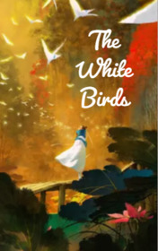

# The White Birds <kbd>v3.2.1</kbd>

  

## Creator
Jane Rollason

## Description
One king had nine sons and a daughter. His wife died while giving birth to Eliza - the youngest child. The children were beautiful, smart and happy. Soon the king fell in love with another woman and married her. The new queen was a wicked and envious woman. She hated the king's children. But he always believed his wife. Love deprived his mind, as it happens to many people. Once the queen decided to get rid of the children. She took them outside the city wall and turned them into birds. The queen ordered them to fly to other lands and find a new home. The enchanted princes flew away and made nests in the trees near the sea. When Eliza found out about this - she ran away from home. The youngest sister firmly decided to find her brothers.
