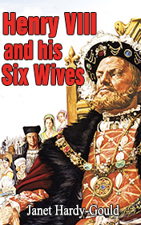

# Henry VIII and His Six Wives <kbd>v3.2.1</kbd>

  

## Creator
Janet Hardy Gould

## Description
King Henry VIII was an influential leader of his time. However, today he is mostly remembered for having six wives. He was known as a good king but a terrible husband. All his wives were very unhappy. There are many legends and rumors concerning Henry's life. This book allows the reader to get more insight into what was really happening in the King's palace. The story is narrated from the perspective of the sixth wife Catherine Parr. After her husband's death the woman goes back to the palace to collect her things. There she comes across a box with five letters. It turns out that the King kept one letter from each of his wives. Catherine reads these messages to her young maid Margaret. Together they discover the former Queens' true feelings and thoughts about King Henry.
