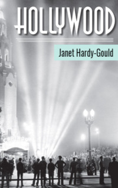

# Hollywood <kbd>v3.2.1</kbd>

  

## Creator
Janet Hardy-Gould

## Description
What first things do you remember when you hear the word Hollywood? The beautiful high-budget films, which you saw in the movie theatres? Terminator, Lord of the Rings or Titanic raised a lot of money and received high marks from the audience. The greatest movie stars, such as Brad Pitt, Johnny Depp or Angelina Jolie, have also become so famous thanks to Hollywood movies. Hollywood is a rather unusual place. This is a part of the city of Los Angeles, which is located in California. It is the second largest city in the United States. This place has a long interesting story and it embodies the entire American film industry. In addition, the music industry is also actively developing there. Everything started in the twentieth century.
