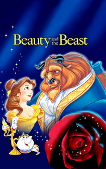

# The Beauty and the Beast <kbd>v3.3.1</kbd>

  

## Creator
Jeanne Marie Leprince De Beaumont

## Description

It's a charming fairytale for the little ones. Once upon a time in the city by the sea lived a rich merchant with his big falimy. He had three sons and three daughters. One of the children, daughter Beauty, was very special. She had a kind heart and was so beautiful, that everybody loved her. One day when merchant went back home across the forest the weather got worse and he had lost his way. Suddenly the man had found a castle and hoped for survive there. The castle was empty, but he had found there a food, warm bed and clothes. The next day, when the weather got better, old merchant went out to the garden and took one most beautiful rose for his Beauty. It was a terrible mistake because it angered the owner of this castle. Now old man had to pay by his death.

