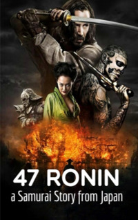

# 47 Ronin a Samurai from Japan <kbd>v3.3.1</kbd>

  

## Creator
Jennifer Bassett

## Description
The plot of this book is based on true events. This story has been retold in songs, legends, theatrical performances for over 300 years. There are several adaptations. Even nowadays the story is known in Japan. It is a real legend. Honor and duty are above all for a samurai. The worst thing for any samurai is not to protect his master. In this case, such samurai becomes a ronin, a warrior without a suzerain. He has no rights and future anymore. In the spring of 1701, Lord Asano crosses his sword with Lord Kira's. In this battle, only one survives. 47 samurai turn into ronin. They have only one goal left - to avenge their master. The story of true loyalty, long journey and revenge on Lord Kira begins. 
