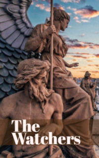

# The Watchers <kbd>v3.2.1</kbd>

  

## Creator
Jennifer Bassett

## Description
His name is Taras. He is very, very old. He is already more than three thousand years old. He has found very old times. He sits under the Palace of Knossos. But he is not alone. His sister Aketa is sitting next to him. She is as old as Taras. They do not need water or food. They never close their eyes. Are they dead or alive? They do not know it. But it is not important. They have been sitting and watching for already three thousand years. They are watching and waiting. They are watchers. There is a god next to them. Poseidon stands in this temple. They look at his statue. It is cast in gold. There is gold everywhere in this temple. The hands of the god are molded of gold, as well as his face and long hair. His golden eyes shine in the darkness. And the brother and the sister watch over him. After all, they are his watchers.
