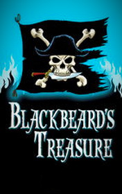

# Blackbeard's Treasure <kbd>v3.2.1</kbd>

  

## Creator
Jenny Dooley

## Description
What do you know about Bermuda Triangle? It's a miracle place where a lot of people, ships and other things were lost. Have you ever heard about the Blackbeard's treasure? It was lost in Bermuda Triangle and nobody ever could find it. Not many people want to have such risk for finding treasure. But there are no any barriers if you are a pirate, you are drunk and you hear the sound of coins. The greatest pirate in the whole world Captain Pike came into the bar of port where many sailors were resting. It was deep night and nobody expect for such celebrity. He proposed them adventure but even they didn't hurry because nobody had never returned Bermuda. At last, Captain Pike managed to collect the team. But whether they can realize his plan?
