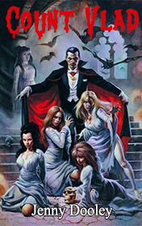

# Count Vlad <kbd>v3.2.1</kbd>

  

## Creator
Jenny Dooley

## Description

This exciting story will admire those readers, who like mythical stories about vampires. Mysterious creatures, which hypnotize their victims and drink blood. One autumn evening two friends Alfred and Elliot were sitting near the fire and having an interesting conversation about their thrilling adventures. Alfred is a journalist and he often has to deal with supernatural. His best friend Elliot helps him in his investigations. They have just come from an exciting but scaring travel in Norway, where they had a case with a ghost. An unexpected note interrupted their dinner. It seems that friends are going to face a new case: the note was from count Dracula. The next day Alfred and Elliot are meeting at the station and leaving for Romania.

