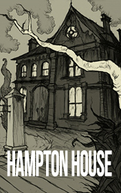

# Hampton House <kbd>v3.3.1</kbd>

  

## Creator
Jenny Dooley

## Description

Helping Hand is a place where people can get any help they need. Every Saturday morning a big group of teenagers gathers there and waits for tasks. They do different work: help in the garden, go shopping, walk with dogs, babysitting and so on. William works there one day in a week too. Now this organization has a new volunteer Kathy Watson. Today Kathy and William go to the old people's home. They deliver a trolley of books there and offer these books to the old. Kathy meets Miss Emily, who tells her a story about Lord Hampton's house. This house was famous by reach and well-known parties arranging there. Miss Emily worked there many years ago when she was young. In her memories the servants of Lord Hampton were always hungry. However he didn’t take any care of them.

