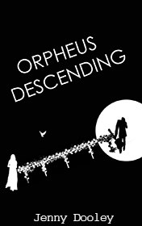

# Orpheus Descending <kbd>v3.2.1</kbd>

  

## Creator
Jenny Dooley

## Description

This book tells us about the myth of Orpheus - the legendary singer and musician of ancient Greece. He was the son of Calliope - muse of the epic poetry and king Oeagrus. When Orpheus was born, his parents made a great celebration. All their relatives and friends came to congratulate the happy family with the gifts. The most welcome guest was Apollo - god of music and light. He prepared something special for the newborn. Apollo gave Orpheus the most valuable thing he had - his lyre. The god of music also predicted Orpheus' future. Kissing Orpheus' forehead, Apollo filled the baby's body by special power. This power gave the opportunity to combine father's music and mother's poetry. And the lyre would open people's hearts and exalt their souls. The masterpiece is adopted poetically and the narration will give real pleasure to the readers.

