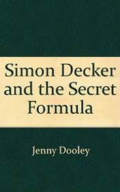

# Simon Decker and the Secret Formula <kbd>v3.3.1</kbd>

  

## Creator
Jenny Dooley

## Description
A thirty-year-old man Simon Decker was sitting in his room and trying to start writing a detective novel. He had been worked as an expert of the bombs for the army for a long time. But then he understood, that this work wasn't his cup of tea and quitted. He got enough time for his passion тАУ creating detective stories. Inspiration didn't want to come to him and the writer stuck on the first paragraph. Suddenly, Simon heard a gunshot, woman's scream and his dog barking. Our hero chased after his dog. The dog led him to the neighbor's house. The window was broken and Simon saw a bloody body through it. The neighbor was still alive. Simon gave him first aid and called to the police. He discovered a telephone bug there. They used such bugs in the army. Who and why wanted to kill his neighbor? This man was just a simple scientist.
