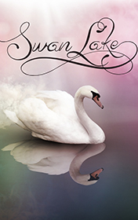

# Swan lake <kbd>v3.2.1</kbd>

  

## Creator
Jenny Dooley

## Description

This is a fairytale, which became known thanks to a famous Pyotr Tchaikovsky’s ballet. It is a love story between Prince Zigfried and a swan. It all has began when the Prince’s father died. The Prince was in a deep sorrow for a long time. His loyal servant Ozlowe tried very hard to cheer him but he failed every time. During his other attempt, he proposed his master to leave their castle for a walk. While they were wandering around a forest, they found a lake. A beautiful white swan with a gold crown on its head was swimming there. Ozlowe decided to kill the animal for Prince’s pleasure and shot an arrow. Prince Zigfried tried to stop his servant but it was too late. Fortunately, the arrow missed its target. Ozlowe became a stone, and the swan disappeared mysteriously…

