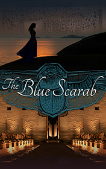

# The Blue Scarab <kbd>v3.3.1</kbd>

  

## Creator
Jenny Dooley

## Description
Monica was walking down the streets in Cairo. She came to a fantastic place. It was a shop selling the presents. It had an exciting decor creating an Asian dream, some kind of an Arabian fairytale. The shop was full of different colourful things and perfect good. Strange, but the shop was empty. There were no customers and even salesmen. Monica found a necklace with a blue stone among the goods. A woman in red appeared from nowhere. She told Monica about the stone, which turned out to be an Egyptian scarab. The woman took the girl to another place outside the shop. She treated Monica to a cup of tea and told her the story of the stone. It was used for making the gods statues so it has a mystical strength. Monica felt tired. She fall asleep and saw her late father in a dream.
