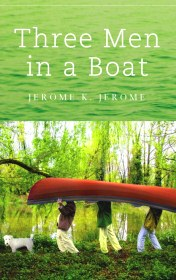

# Three men in a boat <kbd>v3.2.1</kbd>

  

## Creator
Jerome K-Jerome

## Description
Once in the evening, three friends were sitting smoking at Jay in the evening and were discussing the diseases from which they suffered terribly. They came to the conclusion that all their troubles due to overwork and they urgently need a vacation. After a long discussion vacation in the countryside and the sea walk were rejected. In the end the friends decided to go up the Thames by boat from Kingston to Oxford, breaking camps for the nights. Departure was scheduled for next Saturday. George on this day was at work, so Jay and Harris have went to Kingston by train. At Waterloo station they can not find the right train, so they had to bribe the engineer, so he sent his train is in Kingston. There they hired boat were waiting for them. Later Gorge joined them and the journey began.
