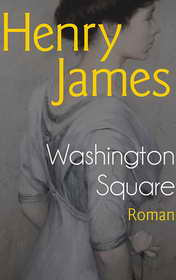

# A Hacker's Revenge <kbd>v3.2.1</kbd>

  

## Creator
John Backhouse

## Description
Mr Henry Williams is an excellent bank manager and has limited computer skills. He has a good network manager Mike who organized a new computer system in his bank. Everything was going well and when Mr Williams was in Bermuda in his mind, dreaming about holiday, he heard a scream of his staff. All system had crashed. It was awful, computers didn't want reboot. Doors were opened and closed when they wanted. Light turned off and turned on the same way. And a head of technology lost his access for system. Someone obtained full control of the bank. Virus was spread through e-mail and entire staff opened it. Mike was powerless to solve this problem and was fired immediately. The question appeared on display of a computer addressed to Mr. Henry. Someone asked him, was he ready for game?
