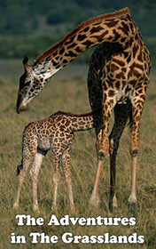

# The Adventures in The Grasslands <kbd>v3.3.1</kbd>

  

## Creator
John Bookworm

## Description

This book is about the dangerous and funny adventures in Africa. You will go to Savannah together with the main hero Jack. He is twelve years boy and he lives there with his parents and an older sister with her husband. You will know a lot about such great animals as giraffes and about their behavior. You'll love a handsome baby giraffe Spotty and his brave and wise mother. Together with Jack, you'll worry about giraffes and will try to save them from angry man Bill. Let us not judge too harshly Bill. He loves his wife so much and always wants her dreams come true and does everything for it, even if it's evil things! One day his wife Jill wanted to have a pet giraffe. So Bill decided to catch the animal in the grasslands, despite the fact that it is illegal.

