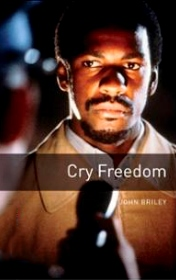

# Cry Freedom <kbd>v3.3.1</kbd>

  

## Creator
John Briley

## Description
In the middle of 1970s, the government of South Africa has a policy of racial segregation. Frequent protests against the ruling regime. Donald Woods - editor of the liberal newspaper "Daily Dispech" published articles critical of one of the leaders of the "Black identity." Addressed Steve Biko. He condemns Biko because he does not have a flexible approach to accumulate racial issues. Steve Biko invited editor in his area. Woods had seen miserable conditions in which the black population lives. After they met Woods changed his mind to Biko. White and black population have to live in equal conditions. They became good friends. Woods was officially banned by the Government of South Africa and he was not allowed to leave their place of residence. Biko is arrested soon.
