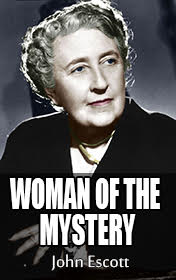

# Agatha Christie, Woman of Mystery <kbd>v3.2.1</kbd>

  

## Creator
John Escott

## Description
The name of the detective queen is known to everyone. The fans of the genre read her novels and revise the screen versions, guessing who the real killer is. The main characters of the stories of Christie - Miss Marple and Hercule Poirot are worldwide famous. These characters are different, only united by their brilliant mind. We know them well enough. But what do we know about the writer? This book will tell you the story of Agatha Christie. The growing up of Agatha Miller passes and she starts travelling. You will visit the countries and the continents with the future writer. The world will surprisingly change during the narration. You will be able learn about the personal experiences of Agatha and her first steps in literal creativity. This magnificent woman lived an extraordinary life.
