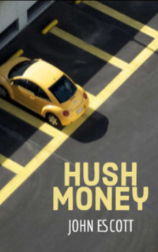

# Hush Money <kbd>v3.3.1</kbd>

  

## Creator
John Escott

## Description
The pub was called 'Green Bird'. It had always been quite a popular place. When it was getting dark, a lot of people came there to have a rest. Especially on Fridays. Behind the pub there was a large parking, which was rarely empty. That day there were also many cars. And there was a woman at the parking standing in the darkness and waiting for something. The woman's name was Rosa. She was hiding behind a big tree so that it was harder to notice her. She usually worked at a hotel six days a week, and took a day off on Monday. It was Monday evening. It was rather cold and Rosa felt discomfort. She was wearing a short and not too warm skirt. But the waiting was not too long and soon a middle-aged woman came out of the pub. She went to her car.
