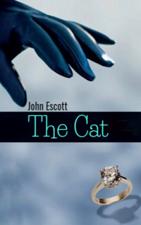

# The Cat <kbd>v3.3.1</kbd>

  

## Creator
John Escott

## Description
The Cat is one of the most famous thieves. Many newspapers write about him. He can enter any house. He steals things from people with lots of money. Nothing stops him. No one has ever seen him. The police are trying to catch The Cat. Zak Wakeman is a movie director. He is making a new movie with the famous star, Natalie Nevons. Nathan is her assistant. Nathan does Natalie's stunts because they are dangerous. Zak thinks Natalie can't do these stunts. But she thinks she can. This evening Zak is having a big party. Natalie and Nathan are there. There are many interesting guests. The Cat is also at this party! He is going to steal from Zak Wakeman. Natalie and Nathan notice him. Who is this famous thief?  
