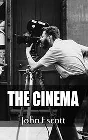

# The Cinema <kbd>v3.2.1</kbd>

  

## Creator
John Escott

## Description
What role does the cinema play in your life? What is movie? It is some kind of a parallel reality where we go for travelling and to be filled with new impressions, emotions and knowledge. Some people just relax. Cinema has become an integral part of our life. Hollywood is traditionally considered the center of the film industry. Nowadays it is a multi-billion business. It was not always like this. In this book, you will read about the history of the cinema creation and development to date. The charming era of silent movies, interesting facts about film creation, Hollywood, the Oscars and special effects are presented in an entertaining form. The book also tells about famous actors, directors and even Disney cartoons. This is a worthwhile thing for the cinema fans.
