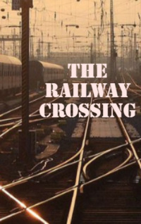

# The Railway Crossing <kbd>v3.3.1</kbd>

  

## Creator
John Escott

## Description
Dunstan was planning a murder. A man was standing at the train station. There were thick trees around. Trains often passed there; it was very noisy. Dunstan's house was not far away hidden behind the trees. The whole setting was very comfortable. The man himself was very nervous. He could not sleep so he had to use drugs. Some blackmail did not let him live in peace. But it would be over soon. Dunstan was going to kill his offender. This whole story began a few years earlier. The man worked for a big company. He had enough money, although he was not rich. He loved a beautiful girl and wanted to marry her. But Dunstan did not have enough money to pay for the wedding, and he stole it from the company: he changed a few numbers in the forms and became the owner of thousands of pounds. This was the starting point.
