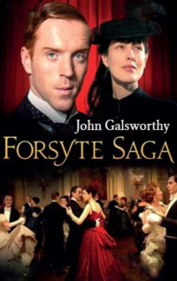

# The Forsyte Saga <kbd>v3.2.1</kbd>

  

## Creator
John Galsworthy

## Description
A classic work of English literature that won the Nobel Prize in the early twentieth century. The saga describes the life of several generations of a wealthy English family, whose life is full of fun and dramatic moments. The novel begins with the story of two brothers. The brothers have not seen each other for a long time. They both are no longer young. But they have managed to earn a lot of money. One of them is terminally ill and now is trying to analyze his life. He wants to understand what he did wrong. The reader travels through the memories of the old man and sees many interesting and vivid scenes from his life. And the life of each member of the Forsyte family is full of unusual events. It is worth reading about.  
