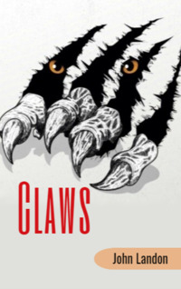

# Claws <kbd>v3.3.1</kbd>

  

## Creator
John Landon

## Description
Larry was a cook. He studied cookery at college. When he left college, he began to look for a job. Soon he got into one hotel. But this work did not please him. So he found a new job in a big restaurant. The restaurant was in the centre of the city. Later Larry also left. He realized he did not like living in big cities. But he needed money. It was May. Larry had no work. The cook tried to find a new job. It was useless. But the young man did not give up. At weekends, he went to the mountains for rest. He loved climbing. In the mountains the young man was free and happy. One day something made him forget about the mountains. An expedition to the mountains of Afghanistan needed a cook. Larry understood this job was for him.
