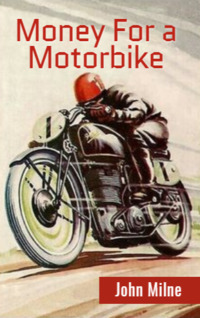

# Money For a Motorbike <kbd>v3.2.1</kbd>

  

## Creator
John Milne

## Description
Stuart is seventeen years old. He has just left school. All his classmates have already started work. But the boy doesn't want to work. He wants to have a long holiday and buy a motorbike. His friend Martin has a good motorbike for sale. It costs 350 pounds. But Stuart has no money. The boy decides to find this sum. He often gets into old, empty houses and looks for something valuable. One day Stuart is going past one house. A rich lady used to live in it. Somebody has already got inside this house. It is a young man called Frank. Frank decides to live here illegally. The man asks Stuart to watch the house while he goes to take his things. Stuart agrees. Suddenly, he finds a lot of money in the house. It is enough to buy a motorbike. Soon Frank comes back. He wants this money. 
