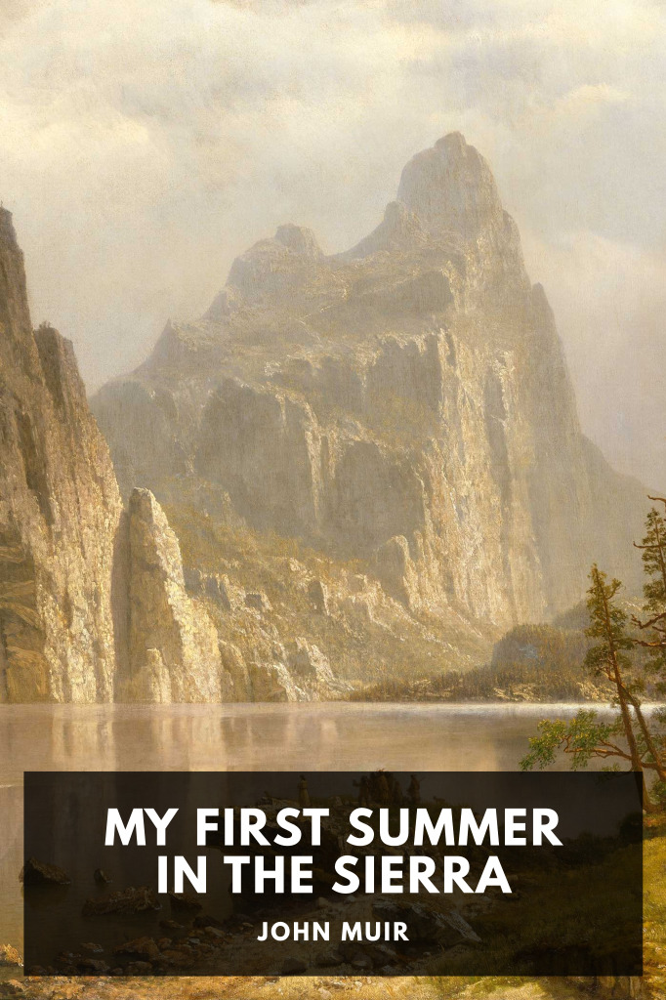

# My First Summer in the Sierra <kbd>v3.2.1</kbd>

  

## Creator
John Muir

## Description
The influential Scottish-American naturalist spends a summer exploring the high country surrounding the headwaters of the Merced and Tuolumne rivers in the Sierra Nevada, and records what he sees in a diary.
