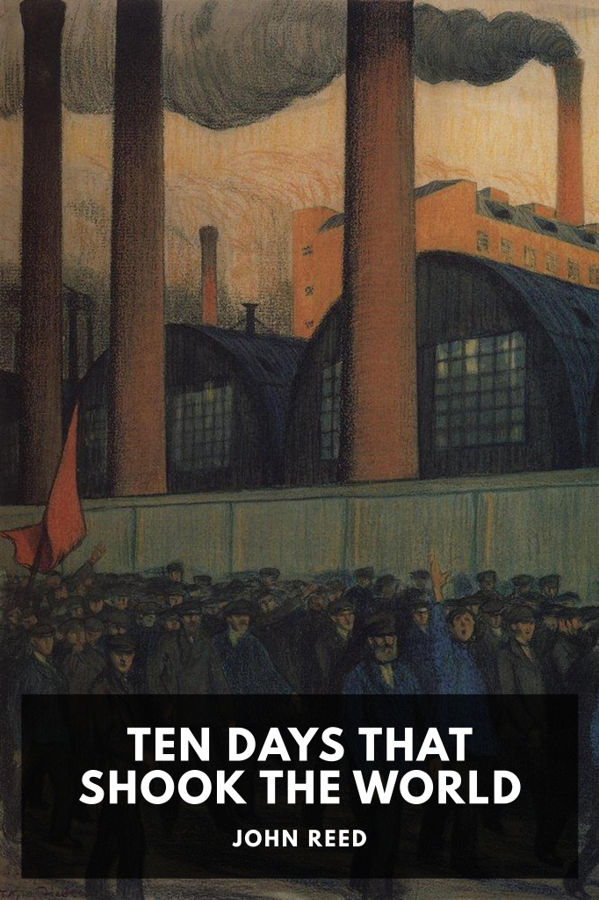

# Ten Days That Shook the World <kbd>v3.2.1</kbd>

  

## Creator
John Reed

## Description
Journalist John Reed gives a first-hand account of Russia’s 1917 October Revolution, which lead to the formation of the Soviet Union.
