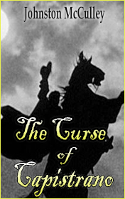

# The Curse of Capistrano <kbd>v3.2.1</kbd>

  

## Creator
Johnston Mcculley

## Description
Sergeant Gonzalez was sitting in a small tavern. He was holding a glass of wine, and a storm was raging outside the windows. The end of February in California turned out to be worrying. Many other military men were sitting around the tables. Gonzalez asked for more wine from the tavern keeper, and he hurried to bring a new batch. The sergeant was famous. But he was very annoyed that the public in the tavern was discussing Zorro. This folk avenger with a sword and a black mask had been the main topic of conversation for ordinary people for a long time. Gonzalez said loudly that he was tired of talking about this man. And that soon there would be the one to put an end to his adventures. The governor offered a large sum for the murder of Zorro. The target would not be able to hide from anyone wishing to receive an award.
