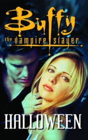

# Halloween <kbd>v3.2.1</kbd>

  

## Creator
Joss Whedon

## Description
At the Halloween Eve Baffy was late on her date with Angel. She was distracted by the vampire. When she came at the club, she saw Angel was talking to pretty Cordelia. Buffy was upset, because her hair was disheveled and  clothes were dirty after the fight. She left. Next day she read in the Giles’s book some information about century of Angel and saw nice women’s dresses of that era. She wanted to impress of her boyfriend vampire and she with her friends bought the costumes in the Ethan's Costume Shoppe. She bought the beautiful dress and thought that she would a beautiful helpless girl from the 18th century. At the same time under the ground in the vampires group the seer told that Vampire Slayer became weak at the Halloween and they would be able to kill her...
