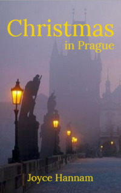

# Christmas in Prague <kbd>v3.3.1</kbd>

  

## Creator
Joyce Hannam

## Description
Jan Vlach was born in Czechoslovakia, but moved to England with his father many years ago. His mother died on Christmas Eve in 1957. Now Jan lives in England and teaches Czech at Oxford University. His wife Carol gets an offer to play in an orchestra in Prague this Christmas. She asks Jan and his father Josef to come with her. Carol flies there earlier as she has rehearsals. After the first rehearsal she goes Christmas shopping. All of a sudden Carol sees her husband in the street. But why has he already come to Prague? What is he doing here? She calls him. But he doesn't stop. He looks at her and then walks away. Carol is shocked. She runs to him but gets into an accident. The woman is taken to hospital. When Jan and Josef finally arrive in Prague, Josef explains everything. It turns out there's more to the story of what happened in 1957.
