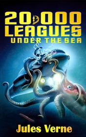

# 20,000 Leagues Under the Sea <kbd>v3.2.1</kbd>

  

## Creator
Jules Verne

## Description

It was in 1867 when first rumors about dangerous and horrible monster that lives somewhere in sea depths appeared. According to witnesses, this creature was enormous and could sink any ship. Many people claimed that it was just a very big whale, but this beast was twice bigger than the biggest known whale. When a Capitan of American ship named 'Abraham Lincoln' was gathering a team for monster hunting, he invited a famous writer and professor of sea world Aronnax to be an expert at expedition. Aronnax took his friend Conseil to be his assistant. Also on board was well-known whale killer Ned Land, who promised if they found the creature, only one of them would survive. Finally, after three months of sailing they have faced with their enemy in the middle of nowhere.

