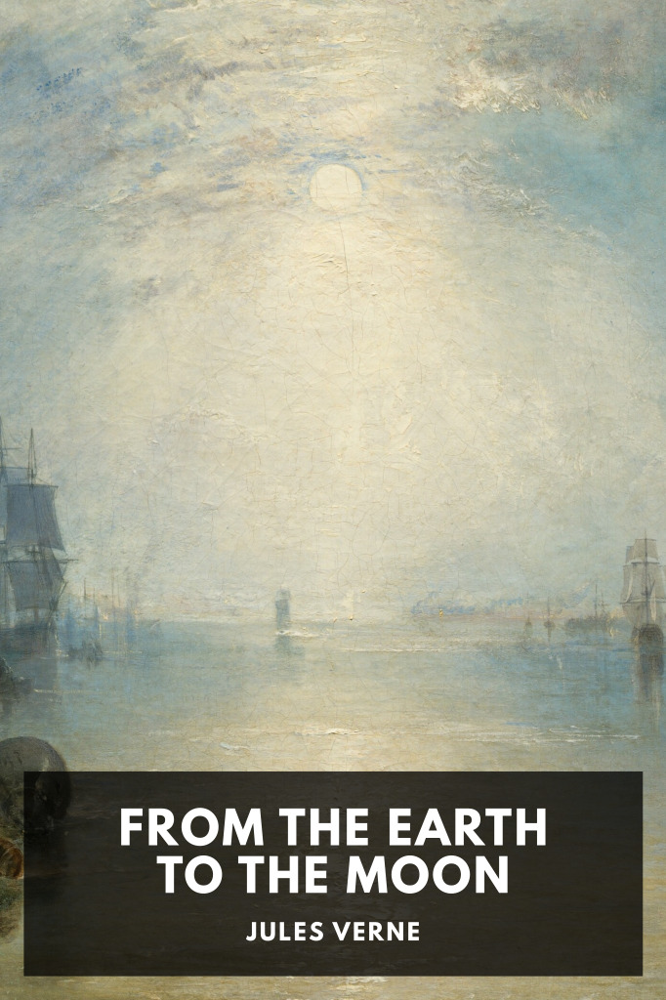

# From the Earth to the Moon <kbd>v3.3.1</kbd>

  

## Creator
Jules Verne

## Description
After the end of the Civil War, the Baltimore Gun Club decides to apply its engineering expertise to the design of a cannon capable of shooting a projectile to the Moon.
