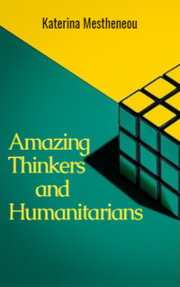

# Amazing Thinkers and Humanitarians <kbd>v3.3.1</kbd>

  

## Creator
Katerina Mestheneou

## Description
There were many people who changed the world. Outstanding personalities whose minds and beliefs influenced thousands human fates. Confucius was a famous Chinese philosopher. Socrates became one of the first scientists in the world. Aristotle continued his work and developed science in ancient Greece. William Wilberforce was the man who put an end to the slave trade in Britain. The name of Gandhi is well known to many today - he was able to free India from British rule. This book will tell more about the lives of people who once changed the world for the better. Each of them lived in his era and faced countless difficulties. Still they managed to overcome everything and remain victorious in history. 
