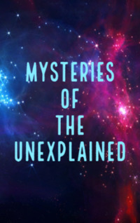

# Mysteries of the Unexplained <kbd>v3.3.1</kbd>

  

## Creator
Kathy Burke

## Description
Space is a mysterious place. It is almost unexplored like the oceans. In the depths of space a lot of interesting and mysterious things can hide. Lots of governments have spent a lot of money on its research for many years. The United States, Britain, and the Soviet Union - each of these countries had space programs with large budgets. But even now there are still more questions than answers. Numerous stories about aliens - are they true or fiction? No one can answer for sure. Not only ordinary people, but also some astronauts say they have seen something strange. Even the famous Neil Armstrong said that he saw some strange luminous objects in space. For many years it was kept secret, but today the information is publicly available. 
