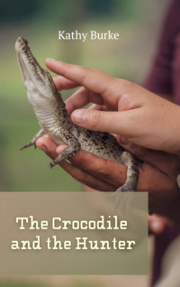

# The Crocodile and the Hunter <kbd>v3.2.1</kbd>

  

## Creator
Kathy Burke

## Description
This is a story about the life of an experienced hunter. One day he went out into the countryside. He went far from his village looking for food. He met a wild cat while hunting. They managed to become friends. Later he met a crocodile that was lost in the tall grass and couldn't find his way home. The kind hunter decided to help him too. But the sly crocodile did not appreciate this kindness. Near the river he grabbed the hunter and dragged him to his home. Many other crocodiles were already waiting for food. But the hunter was not stupid. The man demanded justice from the crocodiles. The carnivorous reptiles agreed to listen to the opinions of other animals. The hunter realized he had a chance to escape. 
