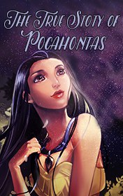

# The True Story of Pocahontas <kbd>v3.2.1</kbd>

  

## Creator
Kelly Reinhart

## Description

This is a story about a strong love that would overcome all obstacles and even stop a bloody war. Pocahontas was a native chief's daughter. She was eleven when, sitting on the top of a cliff, she saw a big ship in the sea approaching the coast. The ship was full of white people who were searching for gold in the New World. All native tribes were certain that war was upon them and would start as soon as the ship would reach the land. But it turned out that the ship dropped anchor only to replenish its freshwater stores. Captain John Smith was chosen as the explorer of the new land. Pocahontas followed John very carefully, trying to find out what he really wanted from the natives. The moment their eyes met, they fell in love with each other. Their mutual feelings were so powerful that they had never left each other since then.

