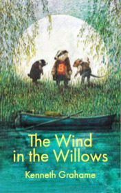

# The Wind in the Willows <kbd>v3.3.1</kbd>

  

## Creator
Kenneth Grahame

## Description
Although 'The Wind in the Willows' was primarily written for a young audience, the book can be of great interest to both children and adults. It follows the adventures of wild animals living on the river bank. Mr. Toad is very rich and lives in a luxurious house called Toad Hall. Toad is a good animal, but he is extremely vain. Besides, he has a weird obsession with vehicles: boats, caravans, motorcars. His friends Mole, Rat and Badger are worried about him. They try to convince Toad to quit this hobby, but he doesn't listen. One day he goes too far and steals a car. Toad finds himself in jail, but he doesn't give up. He uses clever tricks to run away. When Toad finally gets home, he learns unpleasant news: Toad Hole has been taken by ferrets and weasels. Will Toad and his friends be able to get the house back?
